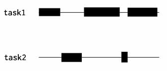

# Algorithem

[669. Trim a Binary Search Tree] (https://github.com/weiboscrapper1/leetcode/blob/master/src/main/java/practice/leetcode/algorithm/TrimABinarySearchTree.java)

# Review

## [Analyzing Java Memory_Part2](https://www.dynatrace.com/resources/ebooks/javabook/analyzing-java-memory/)

### Analyzing GC for Maximum Throughput

我们已经讨论了暂停对程序的响应时间的影响。但是，对于吞吐量或者批处理程序而言，事务速率(`transaction rates`)更重要。因此，我们不需要在意暂停对某个特定事务的影响，而应该关注CPU的使用率和整体暂停时间。

思考下这样一个场景：对于一个对reponse time有要求的程序，如果某个特定的事务需要暂停2秒，这不是我们所希望的，但是如果每个事务都会被暂停50ms，那么因为该事务暂停2秒，反而是可以接受的。如果这个程序运行了好几个小时，那么所有的中断时间会远远大于两秒，而且会使用占用大量的CPU，但是这并不会影响到别的事务。所以，大吞吐量的程序只关于整体暂停时间，在进行GC配置优化时，必然会通过CPU的使用率体现出来。

要想将吞吐量提升至极致，就需要最大程度让GC高效运作，这就意味着GC的执行尽可能地快。由于在GC运行期间，整个程序都被暂停，我们能够，也应该充分利用所有的CPU。与此同时，我们也应该在较长时间内，尽可能将资源的使用降至最低。最佳策略就是并行的完全的GC（与此相对的是CMS的增量设计）。

要想精准衡量GC的CPU使用率很难，但是的确存在一个直观的快捷方式来精确衡量，只需要通过以前所说的一些免费的，或收费的工具，简单检测整个GC的执行时间。最简单的就是方法就是使用`jstat -gc 1s`。该方法会显示每一秒钟CPU的利用率和整个GC的执行情况。

### Allocation Analysis

和C++比起来，Java中分配对象相对容易一些。整个堆经过特别调整，确保临时对象的分配快速和频繁。但这不是免费的。一旦有大量的并发线程涌入，分配会很快变为瓶颈。原因是多方面的，比如，内存碎片，由于太多的分配导致更频繁的GC，并发分配的同步。为了避免分配，最好的方法不是实现对象池，而是不分配。

核心思想是优化算法以避免不必要的分配，或将同一个对象分配多次。例如，我们经常在循环中分配临时对象。如果在循环前创建一个对象并在循环中使用会是一个更好的办法。这也许是小题大做，但是如果对象的尺寸很大且循环次数很多，对吞吐量的影响则会很大。即使这是显而易见的，很多现存的代码都没有遵循这样的做法。

分配分析（`allocation analysis`）是一项将程序中分配最多对象的区域分离出来的技术，因此是最优可能带来性能优化的。有很多免费工具可以用来分析，例如JVisualVM。但是需要了解的是，这些工具对运行时性能有巨大影响，所以不能在产品级的负荷下使用。因此我们只能在QA环境或者特定的性能优化练习中使用。

分析正确的用户案例也很重要，这意味着仅仅分析针对特定代码的单元测试时不够的。大多数算法都是数据驱动的，所以使用产品级的输入数据对任何性能分析来说，都是很重要的。对分配分来来说，重要性显得尤为突出。

### Memory Analysis—Heap Dump

我们已经讨论了GC和分配对程序性能的影响。我已经反复阐述了高内存使用率是过度GC的愿意之一。在很多场合，由于硬件限制，不可能简单地通过增加JVM的堆来提升性能。还有些场合，由于内存使用率一直增加，增加堆空间只是让问题延迟发生，并没有解决问题，在这种场合，就需要通过查看`heap dump`，深入分析内存使用率。

`heap dump`是主要内存的快照。它可以通过JVM函数或者一些使用了JVM TI的工具来创建。但遗憾的是，JVM对`heap dump`的解读并不是同意的。

`heap dump`包含了大量的信息，但这也让分析变得困难。在分析数据时，好的工具和正确的技术是很重要的。简而言之，可以进行下面的分析：

- 识别内存泄漏
- 识别内存占用大户

#### Identifying Memory Leaks

使用趋势转储（`trending dump`）来识别内存泄漏。

#### Identifying Memory-Eaters
下面是需要详细内存分析的场景：

- 趋势分析未能找到内存泄漏
- 程序使用了太多内存，但是没有明显的内存泄漏，需要进行优化
- 由于内存使用增长太快，JVM崩溃，无法进行趋势分析。

进行分析的目的是找到root objects。Dynatrace等工具能够自动找出root objects。


# Tip

### 创建安全的临时目录或文件

#### 方法1：random

```Shell
# 随机临时目录
until [ -n "$temp_dir" -a ! -d "$temp_dir" ]; do
    temp_dir="/tmp/自定义前缀.${RANDOM}${RANDOM}${RANDOM}"
done

mkdir -p -m 0700 $temp_dir \
    || { echo "FATAL: 无法创建临时目录'$temp_dir': $?"; exit 100 }

# 随机临时文件
temp_file="$temp_dir/自定义前缀.${RANDOM}${RANDOM}${RANDOM}"

touch $temp_file && chmod 0600 $temp_file \
    || { echo "FATAL: 无法创建临时文件'$temp_file': $?"; exit 101 }

# 退出前记得删除临时目录
cleanup="rm -rf $temp_dir"
trap "$cleanup" ABRT EXIT HUP INT QUIT
```

#### 方法2：对随机内容进行hash

```shell
$ echo $( (last; who; free; date; echo $RANDOM) | md5sum | cut -d' ' -f1 )
c0b5676e55987de62432117842247286
```

#### 方法3：mktemp或urandom

更专业的实现方式，当然是使用`mktemp`和`/dev/urandom`，但考虑到不是任何系统都支持，为了保证脚本的健壮性，避免不了各种繁琐的验证和错误处理。

```shell
# 调用方法: 
#   $temp_file=$(MakeTemp <file|dir> [path/to/name-prefix])
# 示例:
#   $temp_dir=$(MakeTemp dir /tmp/$PROGRAM.foo)
#   $temp_file=$(MakeTemp file /tmp/$PROGRAM.foo)

function MakeTemp {

    # 首先，确保$TMP变量已设置
    [ -n "$TMP" ] || TMP='/tmp'
    
    local temp_type=''
    local sanity_check=''

    # 类型 file或dir
    local type_name=$1
    
    # 如果未指定前缀，则使用$TMP + temp
    local prefix=${2:-$TMP/temp} 
    
    case $type_name in
    
        file )
            temp_type=''
            ur_cmd='touch'
            
            # 条件测试： 是常规文件、可读、可写、只有我有访问权限
            sanity_check='test  -f $TEMP_NAME -a \
                                -r $TEMP_NAME -a \
                                -w $TEMP_NAME -a \
                                -O $TEMP_NAME'
            ;;
            
        dir|directory )
            temp_type='-d'
            ur_cmd='mkdir -p -m0700'
            
            # 条件测试： 是目录、可读、可写、可执行、只有我有访问权限
            sanity_check='test  -d $TEMP_NAME -a \
                                -r $TEMP_NAME -a \
                                -w $TEMP_NAME -a \
                                -x $TEMP_NAME -a \
                                -O $TEMP_NAME'
            ;;
            
        * ) 
            Error "\n$PROGRAM:MakeTemp 参数错误! file或dir." 1
            ;;
    esac
    
    # 先试下mktemp
    TEMP_NAME=$(mktemp $temp_type ${prefix}.XXXXXXXXX)
    
    # 失败的话，则用urandom
    if [ -z "$TEMP_NAME" ]; then
        TEMP_NAME="${prefix}.$(cat /dev/urandom | od -x | tr -d ' ' | head -1)"
        $ur_cmd $TEMP_NAME
    fi
    
    # 看下创建好没有，没有的话只能退出了
    if ! eval $sanity_check; then
        Error "\a致命错误: 无法创建$type_name with '$0:MakeTemp $*'!\n" 2
    else
        echo "$TEMP_NAME"
    fi
    
} # MakeTemp函数结束
```


# Share
## 并发（concurrency）和并行（parallelism）的区别


### 并行（parallelism）
并行是指在多个task同时进行。
要达到并行状态，最简单的就是利用多线程和多进程。

### 并发（concurrency）
在重叠的时间段内，有多个操作在进行(two tasks can start, run, and complete in overlapping time periods)。

这里需要指出的是，这些task并***不一定***需要是在物理时间上同时进行。

下面的例子，也许能够帮助理解并发的定义：

家里只有妈妈会做饭。10:00到12:00(overlapping time period)，是她做午饭的时间。午饭有两个菜：沙拉(task1)和烤肉(task2)。很显然，妈妈没有同时切菜和烤肉。她应该把肉放到烤架上，点上火，离开去切菜。切会儿菜后停下，去翻滚一下烤肉，然后回去继续切菜，重复这个过程，直到所有工作结束。

所以，从程序执行角度来看应该是这样的：



所以，说起区别：

- 执行时间上，并行肯定是要求同时进行的，而并发不一定是。
- 并行的实现是需要多线程或者多进程的支持；而并发，单核单线程也能实现。

